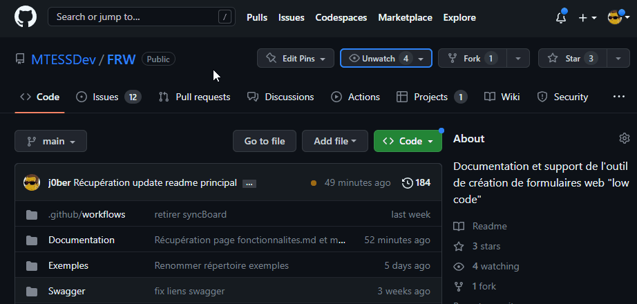

# Configurer les notifications
Dans Github en plus d'être alerté par courriel lors d'un changement sur des éléments auquels vous participez ou êtes identifiés, il est possible d'être alerté lors de l'ajout des éléments suivants : 
- un issue;
- une release;
- une discussion;
- une alerte de sécurité.

Nous vous recommendons fortement de mettre à jour vos notifications afin d'être avisés lors d'une nouvelle release. 

Les releases fournissent de l'information sur les changement inclus dans la nouvelle version et les versions antérieures.

&nbsp;

## Comment configurer les notifications?

